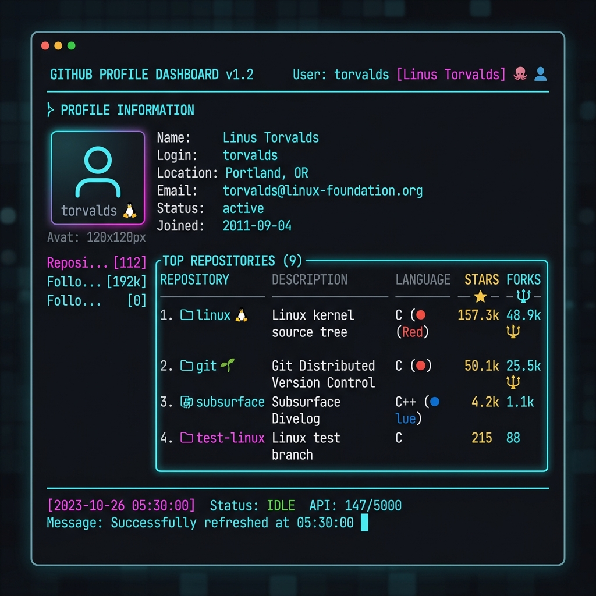

# GitHub Profile Viewer CLI

A premium, high-performance CLI tool for real-time GitHub profile monitoring and data visualization.



## Features
- **Real-Time Monitoring**: Controlled 15-second refresh interval for live data updates.
- **Smart Quota Management**: Automatically respects GitHub's 60 requests/hour limit with built-in pause and countdown logic.
- **Activity Logging**: Success messages and timestamps displayed directly in the dashboard footer.
- **Session Limits**: Configurable max views per session (up to 10,000).
- **Rich Visuals**: Multi-column dashboard showing bio, stats, and top repositories using the `rich` library.
- **Smart URL Parsing**: Accepts usernames or full GitHub profile links.

## Prerequisites
- Python 3.7+
- `requests` library
- `rich` library

## Installation
Install the required dependencies using the provided requirements file:
```bash
pip install -r requirements.txt
```

## How to Run
1. Navigate to the tool directory.
2. Run the script:
   ```bash
   python githubview.py
   ```
3. Enter a **GitHub Username** or **Profile URL**.
4. Set your **Max Views** for the session (default is 1000).
5. Once the dashboard loads, type `watch` to enter live monitoring mode or press **Enter** to search for another user.

## Rate Limiting Note
This tool is designed to work within GitHub's unauthenticated API limits (60 req/hour). If the limit is hit, the tool will gracefully pause and resume once the window resets.
